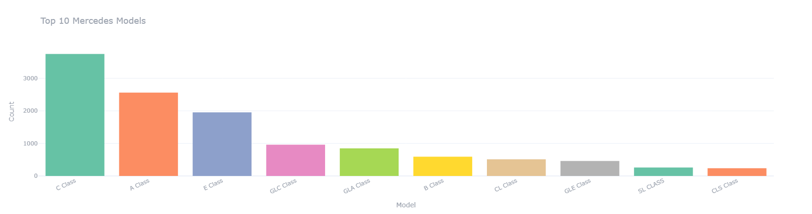
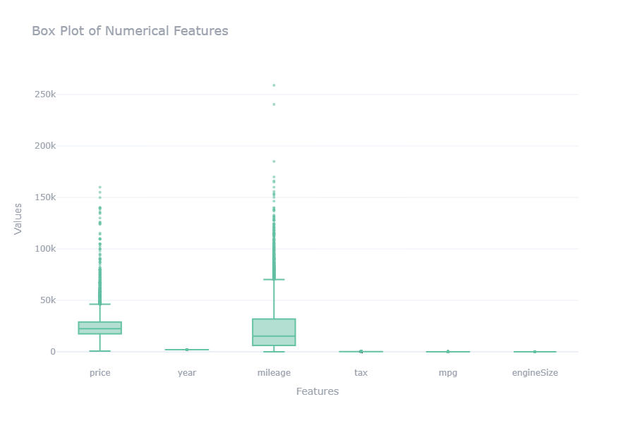
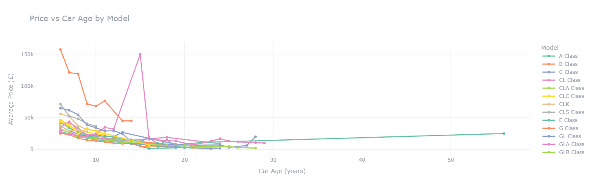
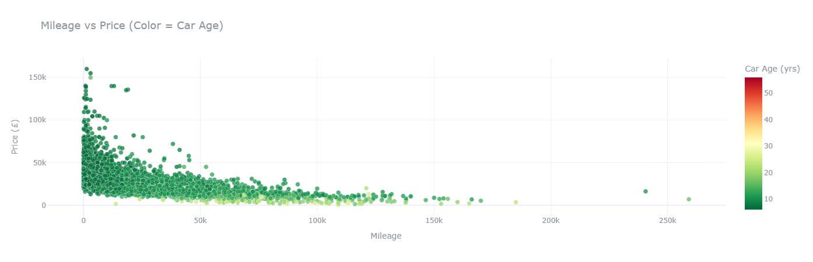
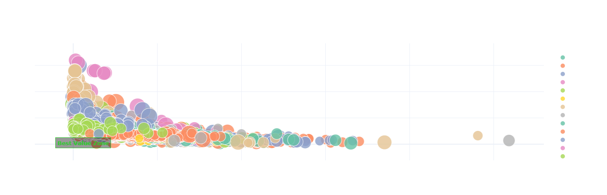
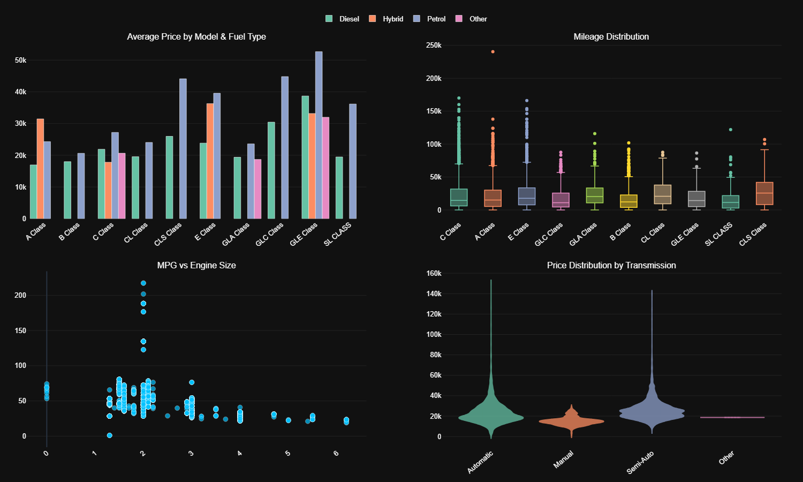

# 🚗 Mercedes-Benz Used Car Market Analysis

An exploratory data analysis (EDA) project on the UK used-car market for Mercedes-Benz vehicles, aiming to uncover the key factors that drive pricing, depreciation, and value for money across different models.

<p align="center">
  
</p>

---

## Overview

This project analyzes a dataset of used Mercedes-Benz cars listed for sale in order to:

- Understand how price relates to age, mileage, engine size, and fuel type
- Detect and evaluate outliers in the data
- Engineer new features that better capture value for money
- Build interactive visualizations and a summary dashboard
- Extract actionable insights about the used luxury car market

---

## Dataset Description

Each record represents a single used Mercedes-Benz vehicle listing.

| Feature | Description |
|---|---|
| `model` | Mercedes-Benz model name |
| `year` | Manufacturing year |
| `price` | Selling price |
| `transmission` | Gearbox type (Automatic, Manual, Semi-Auto) |
| `mileage` | Total distance traveled |
| `fuelType` | Petrol, Diesel, Hybrid, or Electric |
| `tax` | Annual road tax |
| `mpg` | Fuel efficiency (miles per gallon) |
| `engineSize` | Engine displacement in liters |

The dataset is stored as `merc.csv` and loaded directly with `pandas`.

---

## Project Structure

The notebook (`project_file.ipynb`) is organized into the following sections:

1. **Importing Libraries** — `numpy`, `pandas`, `matplotlib`, `seaborn`, `plotly`
2. **Loading Dataset** — reading and previewing the raw data
3. **Data Preprocessing** — checking data types, nulls, and detecting outliers using the IQR method

   <p align="center">
     
     <br/>
     
   </p>
4. **Feature Engineering** — creating new derived features:
   - `car_age`: vehicle age relative to the current year
   - `price_per_mile`: price normalized by mileage
   - `cost_per_mpg`: price relative to fuel efficiency
5. **Exploratory Data Analysis (EDA)**:
   - Price vs. Car Age trends per model
   - Mileage vs. Price scatter plots colored by age
   - "Best Value" bubble chart (price vs. mileage)
   - A combined 4-panel interactive dashboard (price by model/fuel, mileage distribution, engine size vs. MPG, price by transmission)

   <p align="center">
     
     <br/><br/>
     
     <br/><br/>
     
     <br/><br/>
     
   </p>
6. **Results & Conclusion** — summary of key market insights

---

## Key Insights

- **Depreciation:** Price drops sharply and non-linearly over the first 10–15 years before stabilizing below £25k.
- **Premium SUVs lead:** The G-Class and GLE-Class consistently top the valuation list across all age groups.
- **Mileage effect:** Beyond ~100k miles, prices compress heavily below £25k regardless of engine size.
- **Fuel type premium:** Petrol and Hybrid vehicles dominate the highest price tiers, especially in the GLE and CLS lines.
- **Transmission:** Automatic and Semi-Automatic models reach the highest price peaks (up to £160k), while Manual models stay in the low-budget, high-mileage segment.
- **Engine size vs. efficiency:** A clear inverse relationship exists — MPG drops sharply as engine size increases.
- **Vintage effect:** Very old models (50+ years) can shift from depreciating assets to appreciating classics.

---

## Tools & Libraries

- **Python 3**
- `pandas`, `numpy` — data manipulation
- `matplotlib`, `seaborn` — static visualizations
- `plotly` (`express`, `graph_objects`, subplots) — interactive charts & dashboard

---

## ▶️ How to Run

1. Clone or download this repository.
2. Make sure `merc.csv` is in the same directory as the notebook.
3. Install the required libraries:
   ```bash
   pip install numpy pandas matplotlib seaborn plotly
   ```
4. Open and run `project_file.ipynb` in Jupyter Notebook / JupyterLab.

---

## 📄 License

This project is for educational and portfolio purposes.

---

### 🖤 Thanks for checking out this project!
